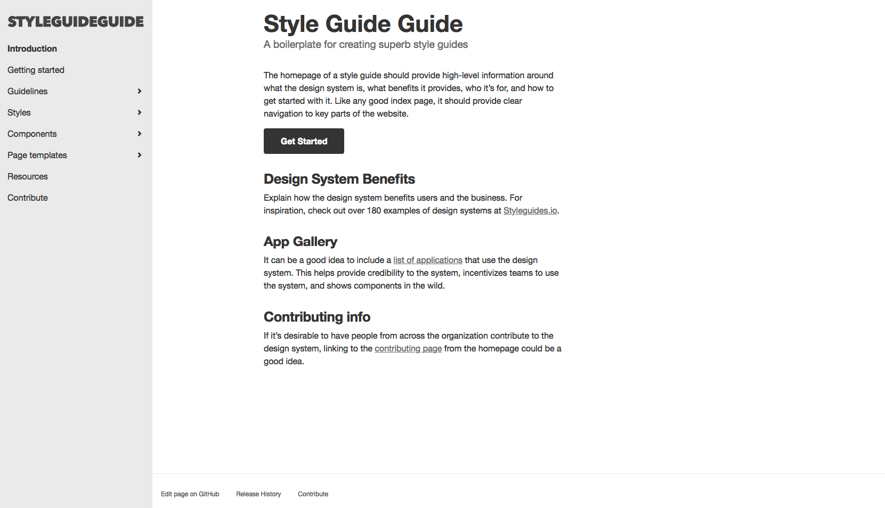

# Design System Template

Design System Template is Jekyll theme and a boilerplate for creating and documenting your principles, style guides and patterns for your organization's design system. It provides just enough IA and hooks to get you going. As a bonus, I've provided links to helpful resources and inspiration to help you as you create your own custom design system. It is based on Brad Frost [Style Guide Guide](https://github.com/bradfrost/style-guide-guide/). The original code was cleaned and reworked, which leads to more straightforward maintenance of patterns and pages. Also, we speed up site generation.

[See the demo here](https://lundegaard.github.io/design-system-template/)

## Documentation

For more information instalation and usage [see wiki](https://github.com/lundegaard/design-system-template/wiki).

## Changelog

### 25. 10. 2018

* **Added support for Storybook.** In `component-detail` layout you can set link to component in Storybook. [See example](https://lundegaard.github.io/design-system-template/components/modal.html)
* **Enable CSS and JS minification.** Example of configuration is in `_config.xml`
* **Added robots.txt and sitemap.xml**
* **Added styles for Do / Don't examples.** [See example](https://lundegaard.github.io/design-system-template/components/modal.html)

## Feedback and Questions
If you have questions or issues with Style Guide Guide, please feel free to [open an issue](https://www.github.com/lundegaard/design-system-template/issues).

## License

The theme is available as open source under the terms of the [MIT License](https://opensource.org/licenses/MIT).

