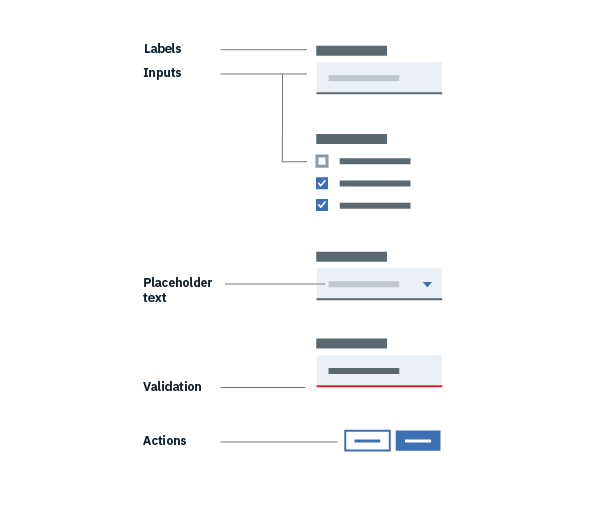
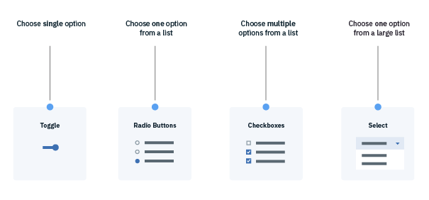

## Effective form design

All forms are comprised of 6 elements:

* Labels: Inform users what the corresponding input fields mean.
* Input fields: Enable users to provide information. Information can be entered through a variety of different input fields ranging from text fields, checkboxes, and many other types.
* Help text: Provides assistance on how to fill out a field. Help text is optional.
* Placeholder text: Hints at what goes into a field. Placeholder text is optional.
* Actions: Allow users to submit a form.
* Validation: Ensures the data submitted by the user conforms to acceptable parameters.

## Form logic

* Radio Buttons are used when there is a list of two or more options that are mutually exclusive and the user must select exactly one choice. In other words, clicking a non-selected radio button will deselect whatever other button was previously selected in the list.
* Checkboxes are used when there are lists of options and the user may select any number of choices, including zero, one, or several. In other words, each checkbox is independent of all other checkboxes in the list, so checking one box doesn’t uncheck the others. A stand-alone checkbox, or a toggle can be used for a single option that the user can turn on or off.
* For fields in which a single selection is required and there are a large number of possible options, consider using a Select element.

## FAQ

Lorem ipsum
