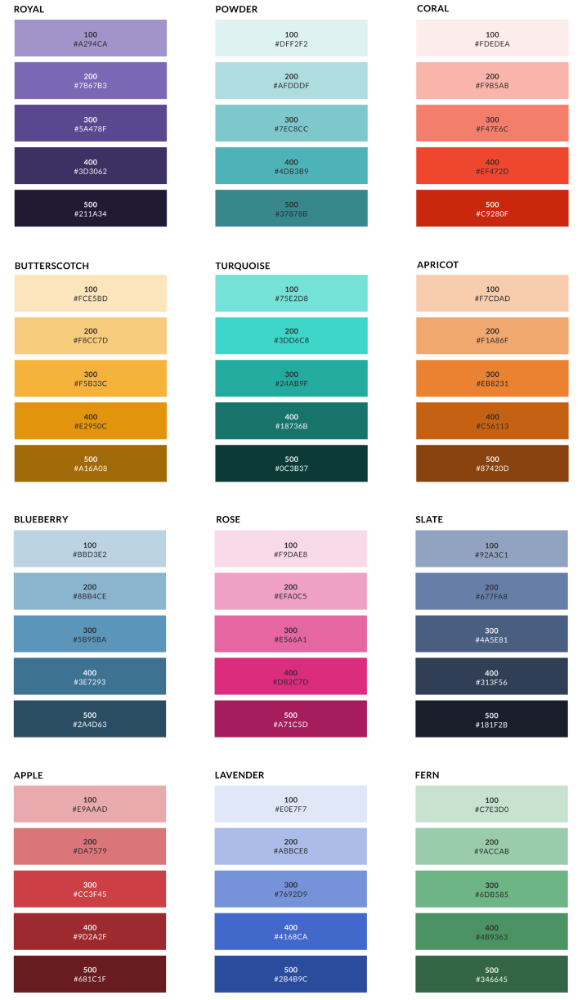
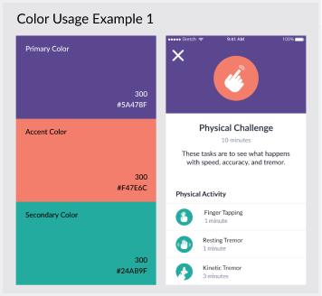
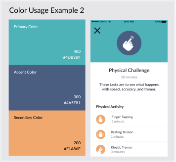
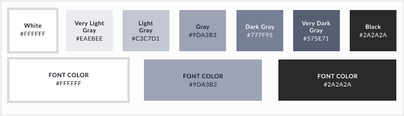
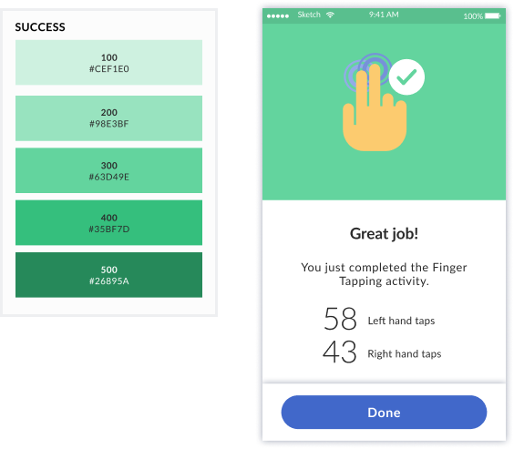
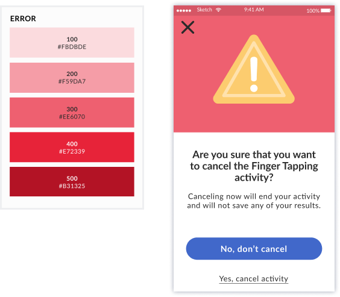

## Selecting Your Colors

When selecting your colors from the Color System, you will always be choosing 1 Primary Color, 1 Secondary Color and 1 Accent Color. You can learn more about how to select each of these colors and how each color will be used in the descriptions below.

## Primary Color

Your Primary Color will be the most commonly used color throughout the experience. This color will be present in your backgrounds, UI and images and will define the feeling that you want to convey in your experience.

Primary Colors should be within the 200-500 numbers of your selected color family (any color except for Cloud, Success and Error) and will be designated with the “Primary” color label.

In order to ensure color accessibility with your typography, the font colors which are necessary for each color are shown in the hexadecimal name on each swatch and will be either “Light” or “Dark”.

## Secondary Color

Your Secondary Color will be present in your buttons and toggles and will be used to drive the user to the given call to action.

Secondary Colors should be within the 100-400 numbers of your selected color family (any color except for Cloud, Success and Error) and will be designated with the “Secondary” color label.

In order to ensure color accessibility with your typography, the font colors which are necessary for each color are shown in the hexadecimal name on each swatch and will be either “Light” or “Dark”.

## Accent Color

Your Accent Color will be present in your progress bars and as a visual accent where needed.

Accent Colors can be any number from 100-500 of your selected color family (any color except for Cloud, Success and Error) and will be designated with the “Accent” color label.
 
 

 
 

&nbsp;
&nbsp;

 
 

#### Using colors from your own branding

Our Color System was created to ensure that accessibility standards are met and colors work well with each other. We highly recommend selecting colors from the Color System when choosing your Primary, Secondary and Accent colors. Should you decide to choose other colors from either a branding handbook or other source, there is potential to run into serious accessibility issues. It’s advisable to avoid this if at all possible.

## Neutral & Text Colors

## Alerts
#### Success

When creating success items such as Completion Screens, Complete copy, etc. you should always be using Success 300/#63D49E. If you have items which don’t contrast enough with the 300 Success Color, you may use other numbers from the Success Color Family.

If your template is a Success screen, you will use Success 300 as the background. You can find more information about these templates here.

 
 

#### Fail/Error/Warning

When creating error items such as Warning Screens, Failure Screens, Incomplete copy, etc. you should always be using Error 300/#EE6070. If you have items which don’t contrast enough with the 300 Error Color, you may use other numbers from the Error Color Family.

If your template is a Fail/Error/Warning screen, you will use Error 300 as the background. You can find more information about these templates here.

 
 
